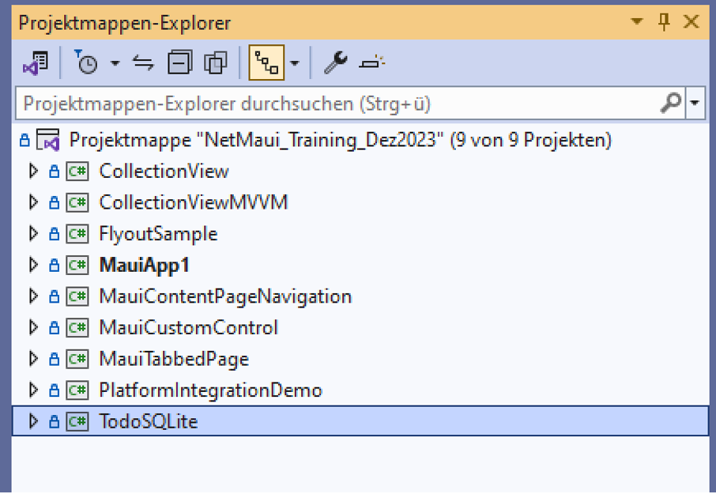
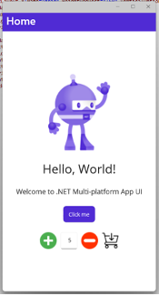
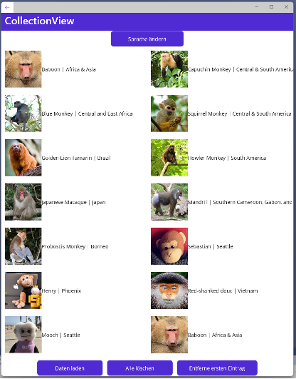
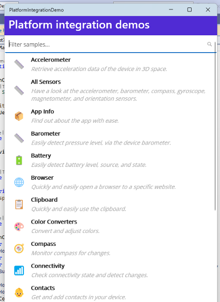
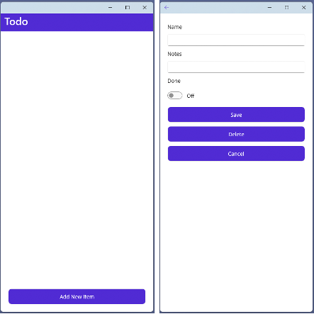

# .NETMAUI-ModerneMultiPlattformAppsentwickeln-236487
KursRepository zu Kurs .NET MAUI - Moderne Multi Plattform Apps entwickeln der ppedv AG

# Android-Emulator

### Hardwarebeschleunigung

## Aktivieren der Hardwarebeschleunigung mit Android-Emulatoren (Hyper-V & AEHD)

[Link zu Learn-Microsoft](https://learn.microsoft.com/de-de/dotnet/maui/android/emulator/hardware-acceleration?view=net-maui-8.0)

Im Emulator Spracheinstellung konfigurieren! (Default: Englisch)

### Probleme:

##### TableView Title=“Ring“

Auf Android Emulator = Okay
Auf Windows Emulator = Text in Kleinschrift! (Ist als Bug aufgeführt)

##### DatePicker Format=“dd.MM.yyyy“

Auf Android Emulator = Okay
Auf Windows Emulator = „.“ Wird nicht akzeptiert, nur „-„ und „/“
- Keine Einstellung für die Sprache möglich

##### WebView Höhe Breite

Auf Android Emulator = Okay
Auf Windows Emulator = Muss mindestens „HeightRequest“ angegeben werden

#### Workaround:

```
<WebView
    Source="https://learn.microsoft.com/de-de/search/?terms=maui"
    HeightRequest="{OnPlatform WinUI=1080}"
    WidthRequest="{OnPlatform WinUI=1920}"
    HorizontalOptions="FillAndExpand"
    VerticalOptions="FillAndExpand"
/>
```


Berechtigungen über direkte Auswahl der CheckBoxen innerhalb VisualStudio

Die Einträge mussten mit dem TextEditor eingetragen werden, da die Anwendung nicht mehr benutzt werden konnte.
Auch das deselektieren hat das Problem nicht beheben können, die Datei musste ersetzt werden.


# Testanwendungen: Kurzbeschreibung



1) ### MauiApp1
   1. #### MainPage.xaml
      1. Unterschiedliche Maui Controls
      1. ContentPage.ToolBarItems
      1. StaticResources / Resources innerhalb View
      1. Implizit / Explizit Style

   1. #### ControlPage1.xaml „Demo: Ansicht nur WinUI“
      1. <Label …/>
      1. <Button …/>
      1. <ImageButton …/>
      1. <Entry …/>
      1. <Editor …/>
      1. <SearchBar …/>

   1. #### ControlPage2.xaml „Demo: Ansicht nur WinUI“
      1. <Checkbox …/>
      1. <Switch …/>
      1. <ProgressBar …/>
      1. <ActivityIndicator …/>
      1. <DatePicker …/>
      1. <TimePicker …/>
      1. <Picker …/>

   1. #### ControlPage3.xaml „Demo: Ansicht nur WinUI“
      1. <TableView …/>
      1. <Image …/>
      1. <BoxView …/>

   1. #### WebView.xaml „Demo: Ansicht nur WinUI“

      


1) ### CollectionView

    

1) ### FlyoutSample
   1. #### MainPageFlyout.xaml.cs
   1. #### HomePage.xaml
   1. #### SettingsPage.xaml
   1. #### FlashlightPage.xaml
      1. ##### Aktivieren der Taschenlampe
   1. #### Map.xaml
      1. ##### Anzeige einer Karte mit Angabe des Ortes oder Koordinaten

         Installierte Kartenanwendung auf Gerät nötig!

   1. #### DateienPage.xaml
      1. ##### Öffnen einer Textdatei und anzeigen im <Editor />

      


1) ### MauiTabbedPage
   1. #### TabPageListView
   1. #### TabPageCollectionView
   1. #### TabPageFlashLight

      

1) ### MauiCustomControl
   1. #### Selbst erstelltes Steuerelement

      

1) ### MauiContentPageNavigation
   1. #### MainPage
   1. #### SecondPage

      

        ##### PageNavigation
        ##### DisplayAlert
        ##### Erstellung Dynamische Buttons


1) ### CollectionViewMVVM
    **Kurzeinführung** 
    - CommunityToolkit.Mvvm
```Paket-Manager-Konsole
        Install-Package CommunityToolkit.Mvvm
```
    und
    - Newtonsoft.Json
```Paket-Manager-Konsole
        Install-Package Newtonsoft.Json
```

    1. #### Demo Laden von Daten via HttpClient()
        

    1. Demo ändern der Sprache mit Auswahl

         

        


**AddOn: (Quelle Microsoft)**
### 1. PlatformIntegrationDemo
- *Demo Plattform spezifische Funktionen*

    

### 2. TodoSQLite
- Demo ToDo-Liste mit SQLite DB Erstellung

    


# AppShell oder Pages

## Konfiguration in App.xaml.cs

Es gibt in .NET MAUI (Multi-platform App UI) die Konzepte der Shell und der nicht-Shell-Anwendung. 
Hier sind die grundlegenden Unterschiede:

1. **Shell-Anwendung: (**MainPage = new AppShell();**)**
- Die Shell ist ein neues Konzept in .NET MAUI, das eine vereinfachte Möglichkeit bietet, die Benutzeroberfläche und Navigation zu definieren.
- Sie ermöglicht eine deklarative UI-Definition und definiert Navigationsstrukturen auf höherer Ebene.
- Die Shell bietet vordefinierte Layouts für häufige Anwendungsfälle wie Tab-Navigation und Flyout-Menüs.
- Sie erleichtert die Implementierung von Standardnavigationselementen in Ihrer Anwendung.

1. **Normale Anwendung (nicht-Shell): (**MainPage = new MainPage();**)**
- Eine nicht-Shell-Anwendung in .NET MAUI erfordert mehr manuelle Konfiguration der Benutzeroberfläche und Navigation.
- Entwickler haben mehr Freiheit bei der Definition von benutzerdefinierten Navigationsstrukturen und Layouts.
- Diese Art von Anwendung eignet sich gut für Projekte, die spezifische UI-Anforderungen haben und eine höhere Anpassbarkeit erfordern.

Die Wahl zwischen Shell und nicht-Shell hängt von den Anforderungen Ihrer Anwendung ab. Shell erleichtert die schnelle Entwicklung von Anwendungen mit standardisierten Navigationsstrukturen, während nicht-Shell-Anwendungen mehr Flexibilität für spezielle Anforderungen bieten.

